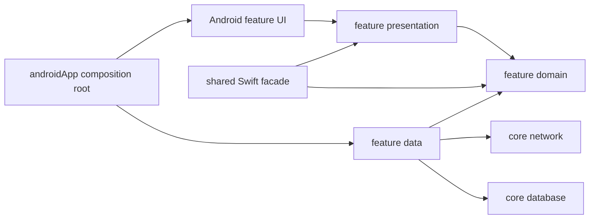

# Portfolio Companion architecture rules

These rules are mandatory for new production code under `mobile/`. Existing code is migrated
incrementally; a feature change must not make the dependency graph worse merely because its
surrounding code predates this document.

The architectural decisions are recorded in
[ADR-0090](adr/0090-adopt-a-clean-multimodule-kmp-architecture.md),
[ADR-0091](adr/0091-standardize-the-android-presentation-stack.md), and
[ADR-0092](adr/0092-use-room-kmp-for-relational-persistence.md).

## Principles

1. Apply Clean Architecture through enforceable dependency direction, not folder names alone.
2. Apply SOLID pragmatically: prefer focused responsibilities, constructor injection, narrow
   consumer-owned interfaces, and composition. Do not create an interface with one implementation
   merely to satisfy a diagram.
3. Organize by feature first and by layer inside each feature. Horizontal core modules contain only
   genuinely cross-feature capabilities.
4. Shared KMP owns domain behavior, use cases, repositories contracts, protocol mapping, and
   deterministic state machines. Android and iOS own native UI, navigation, formatting, and
   platform-security adapters.
5. The Engine remains authoritative. Local persistence is bounded Client state, not a second
   portfolio or accounting database.

## Kotlin code quality

ktlint and detekt are mandatory quality gates for handwritten Kotlin. The root Gradle quality
convention applies them centrally so every current and future KMP or Android module follows the same
rules without carrying private configuration.

- ktlint covers every handwritten `.kt` source set and handwritten `.kts` file in the main
  `mobile/` build and its build logic. It is authoritative for Kotlin formatting and basic style.
  `ktlintCheck` is non-mutating; `ktlintFormat` is exposed only through the local `qualityFormat`
  convenience task and never runs in CI.
- detekt covers production and test Kotlin, including common, Android, JVM, and iOS source sets and
  Kotlin build logic. Type resolution is enabled wherever the target supports it. The central
  configuration uses `buildUponDefaultConfig = true`, `allRules = false`, and
  `ignoreFailures = false`; every finding fails the gate unless a reviewed central rule explicitly
  says otherwise.
- The root build exposes a non-mutating `qualityCheck` task aggregating every included module's
  `ktlintCheck` and supported detekt tasks. `mobileCheck` depends on it. Hosted CI runs
  `./gradlew --no-daemon --continue qualityCheck` in a `Kotlin static analysis` step before compile
  and test tasks and retains reports on failure.
- Android Lint remains a separate required gate, including `:androidApp:lintDevDebug` during the
  migration. ktlint and detekt do not replace platform lint or architectural dependency checks.
- Plugin versions are pinned once in the version catalog. Shared rules live under
  `mobile/config/quality/`, and `mobile/.editorconfig` defines official Kotlin style, four-space
  indentation, LF line endings, a final newline, and a 120-character line limit. Modules do not carry
  divergent private configurations.
- Isolated builds under `mobile/spikes/**` are outside the main `qualityCheck` aggregator and keep
  their own explicit quality workflows. Moving spike code into production immediately enrolls it in
  the main build's quality convention and gates.
- Build-generated sources are excluded. Checked-in generated Kotlin is excluded only by the exact
  filenames `GeneratedProtocolVocabulary.kt`, `GeneratedProtocolFixtures.kt`, and
  `GeneratedExactDecimalVectors.kt`; do not exclude their whole packages because those packages also
  contain handwritten tests. Deterministic generator verification commands remain mandatory and run
  before Kotlin analysis; some generators use `--check`, while ExactDecimal verifies in its default
  no-argument mode.
- ktlint has no baseline. New modules also start with no detekt baseline. If fixing all rollout debt
  in one migration would be disproportionate, one reviewed baseline may temporarily exist only for
  the legacy `shared` or `androidApp` module. A baseline may only shrink, is never regenerated
  wholesale, requires justification for every added entry, and is deleted when empty.
- Suppressions name the exact rule ID, use the smallest declaration or expression scope, and include
  an adjacent reason. File-wide, wildcard, `all`, and unexplained suppressions are forbidden. Test
  code remains analyzed; a test-specific exception must still be narrow and centrally reviewable.
- Keep the current non-UI dependency check. The root `checkModuleGraph` task rejects unregistered
  production modules, forbidden project edges, infrastructure dependencies, and platform plugins
  at the Pairing domain/presentation boundaries; `mobileCheck` requires it. Extend its allowlist and
  layer rules with every new module. Passing ktlint or detekt is never evidence that dependency
  direction is correct.
- ktlint/detekt upgrades are isolated build changes. Apply and review mechanical formatting
  separately from behavioral changes.

## Target Gradle module graph

The current `:core:common`, `:core:model`, `:core:security-api`,
`:feature:pairing:domain`, `:feature:pairing:presentation`, `:shared`, and `:androidApp` modules are
the first migration state, not the final boundary. Create target modules only when moving or adding
real production code. `:core:common` owns `Clock`, application visibility/controller contracts, and
the lifecycle policy; `:core:model` owns `ExactDecimal` plus its characterization assets; and the
first `:core:security-api` tranche owns the secret-free cleanup journal and revocable Snapshot
secure-store contract plus its application-owned plaintext handle. Protocol-dependent security
ports remain in `:shared` until their value dependencies move. Pairing domain owns the secret-free
submission contract plus opaque session/attempt ports, and presentation owns the pure UDF reducer.
The stable Swift-facing `PairingFlow` and `PairingConnection` consume those ports rather than depending directly on
`CompanionFacade`; a non-exported adapter scoped to one facade supplies their current implementation.
Strict protocol decoding and transport remain in `:shared` until their lower-level dependencies move.
Their package direction is already untangled: protocol owns strict JSON and generic envelopes, while
auth owns auth-specific success envelopes. Raw `Json` is now sealed behind a Kotlin-only protocol
codec hidden from Objective-C and Swift. The Ktor transport wraps its sensitive encoded bytes in
`OutgoingContent` with a constant, redacted diagnostic representation and no longer installs
`ContentNegotiation`. Protocol and network are still packages inside `:shared`, not physical Gradle
modules; the next extraction is the real `:core:protocol` module.

```text
mobile/
├── core/
│   ├── common/              # KMP primitives, clocks, result/error contracts
│   ├── model/               # KMP cross-feature domain value types
│   ├── protocol/            # strict wire vocabulary, DTO envelopes, boundary mapping
│   ├── network/             # KMP Ktor execution and platform-engine boundary
│   ├── database/            # KMP Room database, migrations, internal entities/DAOs
│   ├── security-api/        # KMP ports; no platform implementation
│   └── testing/             # reusable test fixtures, never a production dependency
├── feature/
│   └── <feature>/
│       ├── domain/          # models, ports, use cases; KMP
│       ├── data/            # repository implementations and DTO/entity mapping; KMP
│       └── presentation/    # platform-neutral state machine/contracts; KMP, no Compose
├── android/
│   ├── designsystem/        # Material 3 theme and Atomic Design components
│   ├── navigation/          # typed Navigation Compose contracts and root graphs
│   ├── platform/            # Android security, lifecycle, permission adapters
│   └── feature/<feature>/   # ViewModel, Route, Screen, feature-local UI and Koin module
├── shared/                  # thin Apple-framework aggregation and Swift-safe facade
├── androidApp/              # Android application and top-level composition root
└── iosApp/                  # native SwiftUI application and iOS composition root
```

Expected dependency direction:



Rules:

- Domain modules depend only on Kotlin and explicitly approved domain/core common or model modules.
  They do not import Ktor, Room, Koin, Android, Compose, or Swift interop types.
- Presentation modules depend on domain/application contracts, never data implementations.
- Data modules implement domain-owned ports and may depend on network, database, and platform ports.
- Native feature UI depends on presentation contracts and the native design system. It does not
  call DAOs, HTTP clients, or repository implementations directly.
- `androidApp` and the iOS composition root are allowed to know concrete implementations. Feature
  code is not.
- Cross-feature dependencies use the other feature's public domain/API contract. Importing another
  feature's data, DI, ViewModel, or internal UI package is forbidden.
- `:shared` is an aggregation/export boundary for Swift. New unrelated implementations must not be
  placed there merely because both platforms need them.
- Pairing session and attempt capabilities are opaque and scoped to the adapter instance that issued
  them. They have no material getter, are never persisted or logged, and stale or foreign
  capabilities fail closed. Recovery claims its cleanup barrier before deleting key or record
  material so a concurrently admitted replacement attempt cannot be removed silently.
- Dependency cycles are forbidden. A new exception requires an ADR rather than a Gradle workaround.

## Clean Architecture layers

### Domain

Domain owns entities, value objects, invariants, repository ports, and use cases. Domain code is
deterministic and platform-free. Expected failures are typed values rather than display strings or
generic exceptions.

### Data

Data owns transport DTOs, Room entities, DAOs, repository implementations, cache policy, and mapping.
DTOs and entities never escape as domain or UI models. Mapping validates at the boundary and fails
closed for malformed security- or money-sensitive data.

### Presentation

Shared presentation may own platform-neutral state machines and feature presentation contracts.
Android ViewModels and Swift adapters translate them into native lifecycle state. Neither native
layer reimplements domain transitions already owned by shared code.

### UI

Native UI renders immutable state and sends user actions inward. Formatting that depends on locale,
accessibility, or platform conventions remains native. A Composable or SwiftUI View never performs
network, database, cryptographic, or repository work.

## Android dependency injection with Koin

- Koin is the Android DI container. Do not add Koin to `commonMain`, domain modules, or Swift-facing
  public APIs.
- Prefer constructor injection. Production classes must not implement `KoinComponent` or call
  `get()` as a service locator.
- Each Android feature exports one focused Koin module. The application composition root assembles
  feature, platform, and environment modules and calls `startKoin` exactly once.
- Process-retained security/session components use an explicit application scope. Screen state uses
  a ViewModel/back-stack-entry scope. Activity-bound biometric or permission brokers must not be
  captured by process singletons.
- Environment selection belongs to the app composition root. Feature code must not branch on build
  flavor to choose implementations.
- Koin definitions are verified in tests. Tests replace ports with explicit fakes rather than
  mutating a global container from individual test bodies.
- iOS uses its native/manual composition boundary. Koin must not become a cross-platform API.

## Android MVI and unidirectional data flow

Every screen uses these canonical roles:

- `<Feature>UiState`: one immutable, complete rendering state;
- `<Feature>UiAction`: typed user or lifecycle input, serving as the MVI intent;
- `<Feature>UiEffect`: a bounded one-shot platform action that cannot be durable state;
- `<Feature>ViewModel`: exposes `uiState`, `effects`, and one `onAction(UiAction)` input while
  coordinating use cases/shared state;
- `<Feature>Route`: obtains the ViewModel, collects state, handles effects/navigation, and wires the
  stateless screen;
- `<Feature>Screen`: renders `UiState` and emits `UiAction` callbacks only.

The flow is one-way:

```text
Compose event -> UiAction -> ViewModel/use case -> new UiState -> Compose
                                      \-> UiEffect -> Route/platform handler
```

Rules:

- Expose state as read-only `StateFlow`; keep mutation private to the state owner.
- Expose effects as a non-replaying `Flow`/`SharedFlow`; never encode an event as a generation
  counter or boolean that Compose must manually acknowledge.
- Collect Compose state with lifecycle awareness.
- Reducers are pure. Side effects run in an injected handler/use case and feed typed results back as
  actions or domain outcomes.
- Do not keep the same mutable fact in Compose state, a ViewModel field, and a shared state machine.
  Select one source of truth and derive the rest.
- Durable navigation or recovery follows state. Use `UiEffect` only for truly one-shot work such as
  opening system settings, a permission request, or a transient message.
- Effects are never used as a hidden queue of business operations and are never replayed after
  process recreation unless the underlying state still requires the action.
- Composables do not invoke repositories/use cases directly and do not launch unowned coroutines.
- Never display raw Engine messages, exceptions, credentials, identifiers, or database content.

## Atomic Design and the Rotki design system

Android uses Material 3 behavior and accessibility as its temporary visual foundation. Before Phase
U7.1, UI acceptance is functional and interim rather than final visual acceptance. The complete
custom Rotki design system is intentionally a separate final product-design step, performed through
Claude Design after the functional destinations and their states are stable. Until that step, keep a
minimal `RotkiTheme`, use semantic tokens that already exist, and leave reusable candidates
feature-local rather than guessing a generic component catalog. Do not create a broad generic
design-system module until reviewed component specifications have real production consumers.

The dedicated Claude Design step produces proposals for semantic foundations, component inventory,
interaction states, accessibility specifications, and platform guidance. Those proposals become an
implementation contract only after explicit human review and acceptance and after the approved
artifacts are versioned in the repository. Its Android implementation then uses this target Atomic
Design structure:

```text
android/designsystem/
├── tokens/       # semantic color, typography, shape, spacing, elevation, motion
├── atoms/        # smallest reusable controls and display primitives
├── molecules/    # small compositions of atoms with one local purpose
├── organisms/    # reusable sections composed from molecules/atoms
└── templates/    # state-free screen layout skeletons

android/feature/<feature>/
├── route/        # DI, state/effect collection, navigation wiring
├── screen/       # feature pages/screens
├── components/   # feature-private atoms/molecules/organisms when not cross-feature
└── model/        # native UI models and formatting projections
```

Rules before the dedicated design-system step:

- Keep UI custom but based on Material 3; do not ship a second temporary design language.
- Use `RotkiTheme` and existing semantic tokens before introducing raw brand colors, typography, or
  repeated spacing values. Truly feature-specific layout geometry may remain local.
- Keep components feature-local unless they already express a proven cross-feature semantic need.
- Do not block functional tracer work on a speculative atoms/molecules catalog.
- Gate G6 still requires usable accessibility and large text. Deferring visual-system work never
  defers native semantics, touch targets, contrast, or recovery-state usability.

Rules for the final system and its implementation:

- Dependency direction is tokens -> atoms -> molecules -> organisms -> templates -> screens.
  Lower levels never import higher levels.
- Design-system components accept UI primitives/models and callbacks, not repositories, ViewModels,
  navigation controllers, or feature domain services.
- A component enters the shared design system only after genuine cross-feature reuse or a deliberate
  product-wide semantic need. Single-use components stay feature-local.
- Feature screens may compose lower levels but do not become generic design-system components.
- Raw colors, typography, shapes, and recurring spacing values are forbidden in feature UI. Use
  semantic Rotki tokens provided by `RotkiTheme`.
- Prefer Rotki wrappers for branded controls and states. Direct Material 3 primitives are allowed
  for one-off structural behavior when a wrapper would add no semantic value, but they still use
  Rotki tokens.
- Components provide accessibility semantics, minimum touch targets, disabled/loading/error states,
  dark-theme behavior, and large-text resilience from their first production use.
- Previews and tests use redacted fixtures and never real Pairing or portfolio secrets.
- Approved Claude Design artifacts define product design, not business behavior. Domain rules,
  security boundaries, MVI state ownership, and native platform conventions remain authoritative.

## Navigation Compose

- Android navigation uses Navigation Compose with typed, serializable destination contracts. Raw
  route strings assembled in feature code are forbidden.
- `android/navigation` owns the root graph and top-level destinations. Each Android feature exposes
  a graph/destination registration contract rather than editing another feature's graph internals.
- `NavController` is owned by the route/navigation host. It is not passed into ViewModels, shared
  state machines, domain objects, or Composables below the route boundary.
- ViewModels emit state or typed effects; the route maps them to navigation operations.
- Pairing, privacy lock, incompatible, revoked, and recovery states guard the application root.
  Overview, Portfolio, History, and Sources live in the authenticated graph.
- Back-stack and saved-state behavior must be explicit and tested for logout/unpair, Profile mismatch,
  process recreation, and deep-link rejection. No route may bypass Pairing or privacy guards.

## Room KMP persistence

- Room KMP is the only supported relational database technology for new mobile code.
- Keep one database owner in `core:database`. It owns the `@Database` schema plus all Room entities
  and DAOs, organized in feature-scoped packages with narrow APIs. Feature data modules own
  repositories and entity/domain mappers and may depend on those DAO APIs; `core:database` never
  depends back on a feature module. Features do not open independent database files casually.
- Database builders and filesystem locations are platform supplied. Schema and migrations remain
  shared where Room permits.
- Export Room schemas to version control. Every version bump includes a migration and migration test.
  `fallbackToDestructiveMigration` is forbidden in production.
- Room entities and DAO types are data-layer details. Map them to domain types before returning from
  a repository.
- Database work is off the UI thread and cancellation-safe. Multi-table invariants use transactions.
- Access Session credentials, Pairing secrets, private keys, biometric keys, and decrypted Portfolio
  Snapshot content are forbidden in Room.
- The versioned offline Portfolio Snapshot remains the authenticated-encrypted atomic document from
  ADR-0021. Room may store approved non-secret relational metadata or indexes, but it must not become
  a plaintext mirror of the Snapshot or Engine database.
- Do not add a database merely because Room is selected. Add it with the first bounded relational
  use case and document retention/deletion behavior.

## Testing and enforcement

- Domain/use-case tests use no Android runtime, network, database, or DI container.
- Data modules test DTO/entity mapping, malformed input, repository policy, Room migrations, and
  transaction rollback.
- Presentation tests cover every `UiAction`, resulting `UiState`, one-shot `UiEffect`, cancellation,
  and duplicate-action behavior.
- Compose tests assert semantics and user-visible state, not private implementation details.
- Navigation tests cover every root guard and prove that unpaired/locked/revoked users cannot enter
  authenticated destinations.
- Koin modules have definition-verification tests and at least one composition smoke test.
- Once the final design-system step begins, atoms and molecules have light/dark, large-text,
  disabled, loading, and accessibility coverage proportionate to their reuse.
- Gradle checks must prevent forbidden dependencies: domain -> framework, presentation -> data,
  shared KMP -> Koin/Compose/Navigation, and feature -> another feature implementation.
- `qualityCheck` runs ktlint and detekt across every handwritten Kotlin module in the main mobile
  build and is required by `mobileCheck` and CI; isolated spikes retain their own gates.

## Incremental migration

Do not perform a big-bang package move. Use this order:

1. Add convention plugins and extract stable core common/model/protocol/network/security contracts.
   The reusable KMP library convention plus `:core:common`, `:core:model`, and the first
   `:core:security-api` tranche are in place. Common owns `Clock` and application-lifecycle
   contracts, while its authored protocol-fixture parity test remains in `:shared`. Security API
   owns the cleanup journal and Snapshot-store boundary; protocol-dependent security ports,
   protocol decoding, and network execution remain in the umbrella until their coherent slices move.
2. Move Auth/Pairing into domain, data, and presentation modules without changing behavior. The
   submission/session/attempt domain contracts and pure presentation reducer are extracted.
   `PairingFlow` and `PairingConnection` now use a facade-scoped port adapter, including the recovered
   cleanup barrier. Extract the remaining protocol, network, and security leaves from step 1 before
   moving QR decoding and remote registration into a real Pairing data module; do not add a
   placeholder module or a dependency on `:shared` from data.
3. Introduce Android Koin modules and replace the manual composition root slice by slice.
4. Add typed Navigation Compose and only the minimal Material 3/`RotkiTheme` foundation needed to
   migrate Pairing and the four-tab shell. Do not build the full component catalog yet.
5. Create the Room KMP module only with its first approved relational use case.
6. Build Overview, Portfolio, History, and Sources directly in the target module shape.
7. After the functional destinations and Gate G6 are stable, run a dedicated Claude Design step and
   implement the complete Atomic Design-based Rotki design system across the native clients.

Every migration commit keeps Android, JVM, and Apple targets buildable and preserves the Swift-safe
facade. Compatibility shims are temporary, documented, and removed once their last caller moves.
