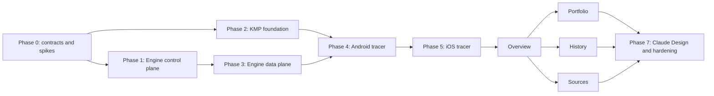

# Portfolio Companion: execution roadmap

Execution plan for the personal Kotlin Multiplatform Portfolio Companion described by
[`CONTEXT.md`](../CONTEXT.md) and its [ADRs](adr). This is a living document:
each implementation slice updates its status, verification evidence, and any decision that
changed. It does not authorize widening Companion Scope.

## Status

| Phase | Outcome | Status |
|---|---|---|
| 0 | Protocol specifications and risk spikes | **in progress** |
| 1 | Engine identity and authorization control plane | **in progress** |
| 2 | Isolated KMP build and shared foundation | **in progress** |
| 3 | Coherent Engine data plane | **not started** |
| 4 | Real Android tracer bullet | **in progress — Device registration slice** |
| 5 | Equivalent iOS/SKIE tracer bullet | **host shell only — tracer not started** |
| 6 | Four complete native destinations | **not started** |
| 7 | Full design system, hardening, and handoff | **not started** |

The isolated KMP foundation and native Android/iOS shells are under active development; no
Portfolio feature or Engine data-plane implementation has started. `CONTEXT.md`, the ADRs,
this roadmap, the production `mobile/` build, and the remaining Phase 0 spikes are the
current implementation and characterization artifacts.

## Delivery shape



Phase 1 and Phase 2 may proceed in parallel after the automated Phase 0 contracts and
spikes pass. The deferred physical-iPhone portion of P0.3 remains a hard gate before
production iOS security or tracer work; it is not a blocker for Engine, shared KMP, or a
non-data-bearing SwiftUI build/interop shell. The real Android tracer remains a hard gate:
no iOS Pairing implementation, secure storage, Portfolio data, or remaining destination
work starts before it passes. The iOS tracer then proves that shared behavior is genuinely
multiplatform before feature expansion.

## Working rules

1. Prefer a vertical, reviewable feature-branch change that leaves every affected runtime
   buildable. Avoid a long-lived branch containing the whole migration.
2. The Engine remains authoritative. Mobile never opens the user SQLCipher database and
   never reimplements accounting, decoding, source credentials, or Profile unlock.
3. New protocol behavior is additive under `/api/1`; `/ws` shares the canonical Engine
   origin and listener. Do not introduce a second WebSocket URL or port.
4. Expected failures are stable wire codes mapped into typed shared outcomes. Display
   strings never become protocol or domain values.
5. Exact financial values stay decimal strings on the wire and use `ExactDecimal` from
   `:core:model` in shared KMP behavior. `Float` or `Double` may appear only inside an explicit
   rendering projection.
6. Each protocol change includes Engine tests, shared serialization tests, and a live golden
   Profile contract test. Mocks alone cannot satisfy a gate.
7. No production code may add analytics, crash upload, trust-all TLS, cleartext fallback,
   mobile signing secrets, or backup-eligible credentials and snapshots.

## Phase 0 — Freeze contracts and burn down technical risk

Phase 0 produces specifications and disposable spikes. It may add test-only scaffolding,
but no production endpoint or UI.

### P0.1 — Engine Protocol bootstrap and error specification

Create `mobile/docs/protocol.md` with request/response examples and a
table-driven state matrix for:

1. unauthenticated protocol version and Capability discovery;
2. Full Client creation of a two-minute Pairing secret for the open Profile;
3. pre-session registration of a Device Key using that single-use secret;
4. a 60-second, single-use challenge bound to the Device Session and Engine origin;
5. signed proof yielding a short-lived Access Session only when the bound Profile is open;
6. proof responses for Locked Engine, Profile Mismatch, incompatible protocol, and a
   Device Session that is no longer authorized;
7. Access Session renewal, expiry, revocation, and WebSocket closure.

Freeze the Engine-generated Pairing QR as the strict versioned JSON defined in
`mobile/docs/protocol.md`; the Full Client only renders it, and registration carries its
credential in the Bearer header plus a redacted Device Key request body.

Baseline for the specification: do not issue a data-capable session in Locked Engine or
Profile Mismatch states. A successfully authenticated proof exchange returns the typed
state without Profile data; the Client repeats proof after the user resolves the state in
the Full Client. Start with a 15-minute Access Session, renew at five minutes remaining,
and keep the durations behind fake-clock tests so later tuning is not a schema change.

Preserve the v1 `{result, message}` envelope and add a required typed `error` containing
`code`, `retryable`, and `action` to every non-2xx Companion response. Cover Pairing
expiry/replay, unauthorized device, challenge expiry/replay, locked Engine, Profile
mismatch, missing Capability, incompatible protocol, scope denial, snapshot unavailable,
and source Refresh failure. Specify HTTP status, whether local Pairing survives, whether
the snapshot remains visible, and the native recovery action for every code.

Use the closed status/recovery table in `mobile/docs/protocol.md`. Only
`not_authorized` destroys the local Device Session and Snapshot; transport, contract,
session-expiry, locked, mismatch, rate-limit, and server failures retain them.

Exit criteria:

- every root state in ADR-0010 has one unambiguous protocol path;
- `/protocol` advertises integer protocol versions and the versioned Capability registry,
  while every other Companion HTTP/WS request validates `Rotki-Companion-Protocol`;
- no response before Device Key proof reveals Profile ID, Profile name, or portfolio data;
- unknown fields are additive, while missing required fields fail the contract;
- negative Companion Scope examples are part of the specification;
- Engine, Kotlin, and Swift naming is generated from one checked-in vocabulary table.

Implementation status (2026-08-13): complete. The canonical vocabulary, generated
cross-language names, behavioral matrices, strict Pairing QR cases, auth/control success
examples, and a cryptographically verified Device Key proof vector are checked in under
`mobile/protocol/v1/`; the focused static validator lives at
`rotkehlchen/tests/api/companion/test_protocol_spec.py`. The generator drift check, focused
pytest suite, Ruff, and mypy are green. This slice remains specification and test scaffolding
only: it adds no production endpoint or UI.

### P0.2 — `ExactDecimal` characterization spike

Build a throwaway shared test target around a project-owned `ExactDecimal`; keep
`ionspin BigNum` internal as the first candidate. Run identical JSON vectors against
Python `FVal`, JVM, and Kotlin/Native for:

- canonical decimal-string parsing and round trips;
- positive and negative zero, magnitude, scale, and at least `uint256` precision;
- comparison, addition, subtraction, multiplication, division policy, and display-only
  rounding;
- sorting and aggregation without binary floating point;
- rejection of malformed and non-finite inputs.

Exit: byte-identical canonical output and identical comparison/arithmetic results on JVM
and iOS. If the candidate fails, replace only its private backend. No snapshot schema or
financial DTO merges before this passes.

Implementation status (2026-08-13): complete and migrated into the production build by M2.1.
The 72 vectors generated from Python `FVal` pass byte-for-byte on JVM, Android host, and
`iosSimulatorArm64`, and the `iosArm64` test binary links. BigNum 0.3.10's direct division
incorrectly truncated `2 / 3`, so the private backend performs exact BigInteger
quotient/remainder HALF_EVEN rounding while the public type and serialized schema remain
candidate-independent. M2.4 subsequently extracted the complete slice from `:shared` into the
`:core:model` leaf without introducing another Apple framework. Tool pins and the observed limitation are retained in
`mobile/docs/characterization/exact-decimal.md`. This completes P0.2 but not Gate G0,
which still requires the deferred physical portion of P0.3.

### P0.3 — Native-security and SKIE characterization spikes

Prove the following with minimal non-production apps:

- Android API 28: non-exportable P-256 signing key and biometric-gated AES-GCM key;
- iOS 17 physical device: non-exportable signing key and an AES-GCM content key wrapped
  by a biometric-gated Secure Enclave key;
- Kotlin 2.4.10 plus SKIE 0.10.14: typed `StateFlow`, suspending call cancellation, enum,
  and every sealed root-state case compile in a representative Swift consumer;
- the same shared core still builds with SKIE disabled.

Biometric-only means there is no PIN/device-credential fallback. Missing enrollment or
hardware blocks Pairing with an explanation; temporary lockout leaves the Client locked;
key invalidation after biometric enrollment changes destroys inaccessible local material
and requires a new Pairing. Simulator/emulator fakes are debug/test-only and cannot
replace the physical-device acceptance run.

Gate G0: protocol and error specifications are reviewed; all three spikes pass; selected
library/tool versions and observed limitations are recorded. A failed spike changes the
implementation choice behind an existing boundary, not the product boundary.

Implementation status (2026-08-13): automated characterization complete; physical
acceptance pending. The isolated `mobile/spikes/android-security/` build proves the
protocol transcript and P-256 wire formats, non-exportable Android Keystore signing,
biometric-only per-operation AES-GCM policy, atomic backup-excluded storage, and typed
invalidation behavior. Its 17 JVM tests and six non-interactive instrumentation tests pass
on a clean managed API 28 device; three prompt-dependent tests remain explicit opt-in
physical checks. `mobile/spikes/skie-interop/` passes clean SKIE-enabled and SKIE-disabled
builds, the representative Swift consumer, both iOS framework type checks, typed
`StateFlow`, sealed states, and bidirectional cancellation. The checked-in iOS 17 Swift
package and disposable SwiftUI host under `mobile/spikes/ios-security/` pass 33 Swift
package tests, iOS Simulator tests, signed Simulator launch/continuity smoke, and unsigned
arm64 device builds. They characterize separate Secure Enclave signing/wrapping keys,
`biometryCurrentSet`, AES-GCM storage, lifecycle races, typed cleanup, and reinstall
continuity. The path-filtered native-spike workflow pins the supported Xcode 26.4
toolchain and now passes every automated gate, including launch of the SwiftUI security host
on an iOS Simulator. Gate G0 remains incomplete until the README's pending checklist passes
on a physical iPhone running iOS 17.x; simulator success is not Secure Enclave evidence.

Deferral record (2026-08-13): the owner currently has no physical iPhone available, so
the iOS 17 checklist is deferred, not waived. Engine slices E1.1–E1.5 and shared KMP
foundation work beginning with M2.1 may proceed while this item remains open. Do not mark
Phase 0 or Gate G0 complete, start production iOS native-security/tracer work, or claim
physical Secure Enclave/biometric acceptance until the checked-in checklist has passed on
the device and its evidence is recorded here.

## Phase 1 — Engine identity and authorization control plane

### E1.1 — Stable Profile identity

Add a cryptographically random opaque Profile ID to the encrypted user DB by extending the
current unreleased user-DB migration from v52 to v53; do not create a v53-to-v54 upgrade or
bump the database version for this slice. Touchpoints include:

- `rotkehlchen/db/schema.py` and the existing
  `rotkehlchen/db/upgrades/v52_v53.py` upgrade;
- the singleton encrypted `profile_metadata` record and internal
  `DBHandler.get_profile_id()` accessor in `rotkehlchen/db/`;
- upgrade, backup/restore, independent-generation, lineage, and non-exposure API tests.

The value is generated once by a cryptographically secure random source and stored as
exactly 32 raw bytes. It is not derived from the username or Profile contents, is never
returned by normal Profile-list, settings, database-info, login, or diagnostic APIs, and
remains stable through restarts and ordinary DB backups. Distinct Profiles must receive
distinct values when independently created; a restored or cloned Profile that preserves
the value intentionally remains in the same authorization lineage. The identifier itself
grants no authority.

Implementation status (2026-08-13): complete locally; hosted validation pending. Fresh
Profiles and the existing unreleased v52-to-v53 upgrade now create one constrained
`profile_metadata` row backed by `secrets.token_bytes(32)`. Fresh schema, Profile ID, and
database version creation share one SQLite transaction. Internal reads validate exactly one
32-byte BLOB and fail closed instead of silently rotating identity. The full 38-test DB
upgrade suite and the focused identity, schema, backup, atomic-rollback, and API privacy
tests pass, including stable reopen/backup bytes, distinct independently created Profiles,
deterministic migration generation, malformed or missing metadata, and non-exposure through
the ordinary users, login, settings, info, and database-info responses. Ruff and Pyright
pass for the affected backend files. A restore or concurrent clone retains the same Profile
ID and therefore the same Device Session authorization lineage; Profile ID alone cannot
distinguish those copies, so E1.2 must neither reject them as collisions nor rotate identity.

### E1.2 — Migrated `control.db`

Create `rotkehlchen/api/companion/` and a dedicated store for schema versioning,
Device Session records, public Device Keys, Profile bindings, labels, platform, Pairing
time, last-seen time, and revocation. Keep short-lived secrets, challenges, and Access
Session membership in disposable memory.

The store must:

- migrate forward rather than drop on version mismatch;
- be readable while the user DB is locked;
- contain no Profile name, password, private key, bearer token, or portfolio data;
- serialize writes and recover cleanly after interruption;
- atomically delete a revoked Device Session's public key and algorithm, retain its
  non-authorizing audit identity and immutable revocation timestamp indefinitely in version
  1, and never reauthorize or reuse that identity;
- derive record state from authorization facts, return unknown and revoked lookup outcomes
  indistinguishably, and order equal-time records by decoded unsigned Device Session ID
  bytes rather than their Base64URL text;
- fail closed on corruption, malformed current schema, and unsupported future versions:
  ordinary Engine use remains available, but Companion authorization is disabled and the
  `device_sessions` Capability is omitted instead of recreating the database or returning
  `not_authorized`.

The host-local Control Store is excluded from automatic Profile backup, premium
synchronization, and development-instance seed copying. Restoring a Profile preserves its
authorization lineage; restoring an old Control Store is unsupported outside an explicit,
consistent whole-host recovery because it can resurrect later-revoked authority. Persist no
trusted Engine origin in this store: disposable Pairing and Challenge state captures the
canonical origin from the trusted forwarding boundary, and challenge creation re-derives it
after restart. An Engine restart invalidates every outstanding Pairing without changing
durable Device Sessions.

Add focused tests under `rotkehlchen/tests/api/companion/`, including migration fixtures,
concurrent registration/revocation, strict P-256 point and Unicode-label validation,
byte-ordering fixtures, backup/seed exclusion, corruption behavior, and assertions over
actual table contents.

Implementation status (2026-08-13): complete locally; hosted validation pending. The
RestAPI-owned store is created under `global/control.db` before the Engine main loop, stays
available across Profile locks and switches, and closes after API task cancellation. Its
strict v1 schema, forward-only transactional upgrade runner, serialized WAL/FULL writes,
P-256 and Unicode validation, immutable revoked audit rows, runtime fail-closed behavior,
and redacted value objects are covered by the companion suite. The suite also exercises
fresh and interrupted creation, synthetic upgrade rollback, corruption and future-schema
refusal without rewriting, raw-byte ordering, collision retry, concurrency, lifecycle, and
API integration. Static review and a focused predicate check cover dev-seed exclusion;
Ruff, MyPy, Pyright, Pylint, compileall, and focused API regressions pass.

### E1.3 — Capability, Pairing, challenge, and Access Session endpoints

Add `/api/1/companion/*` resources to `rotkehlchen/api/v1/resources.py`, routes to
`rotkehlchen/api/server.py`, and implementation modules beneath
`rotkehlchen/api/companion/` for the P0.1 contract. Route every method through the
Companion-specific deny-by-default authorization matrix after any exemption from the
browser-cookie gate. Implement the resource matrix frozen in `mobile/docs/protocol.md`;
keep Device Session IDs for challenge/proof in redacted bodies, and derive the mobile
self-management target from its Access Session rather than accepting an ID. Carry Pairing
and Access credentials only as standard Bearer authorization headers, dispatch them to
separate route-selected stores, and add cross-realm negative tests.

Use a purpose-derived signing domain distinct from browser and MCP credentials. Access
Sessions are short-lived and disposable; every request also verifies the Device Session
is still authorized and bound to the currently open Profile. Close matching `/ws`
connections immediately on revocation. Pairing secrets and challenges use cryptographic
randomness, single atomic consumption, fake-clock tests, and no log representation.

Implementation status (2026-08-15): unadvertised groundwork only. A bounded,
process-scoped Pairing store now issues two-minute Pairing authority and keeps five-minute
exact Device Session registration replay, with domain-separated process-keyed bindings for
Profile, origin, and credential plus protocol, idempotency, and semantic-request binding.
Pairing consumption, durable Control Store registration, replay tombstoning, and
active-secret removal are serialized in process. Expired authority is rejected exactly at
its deadline; physical cleanup of its cached response currently occurs on the next store
operation or explicit clear. No `/api/1/companion` route is registered and no
`device_sessions:1` Capability is advertised.

The trusted ingress and deny-by-default dispatcher primitives are also present but remain
unadvertised. Docker Starling accepts an optional env-only fixed canonical HTTPS origin only
when cookie auth, secure-cookie mode, and at least one explicit TLS-terminator CIDR are
configured. It strips external lookalike metadata on every proxied target and injects one
complete origin/source pair only for the exact Companion namespace, an explicitly trusted
socket peer, and a single trusted HTTPS forwarding token. Companion source resolution never
uses the legacy default-private trust set, and Starling access logs conservatively redact the
namespace without rewriting the forwarded URI. Core has a strict redacted request-context
adapter plus the frozen sixteen-pair method/rule-to-realm classifier; while no dispatcher or
resource is registered, Companion requests reaching core short-circuit before legacy
cookie/MCP fallback to a typed, non-cacheable `404 resource_not_found`, with fixed
request/error logging. Starling-level transport/body-limit failures remain transport errors.

Device Session control routes, challenge/proof and Access stores, actual realm verifiers,
resource handlers, WebSocket invalidation, bounded expiry sweeping, and the atomic route plus
Capability flip remain E1.3 work.

Required security tests:

- expired, replayed, concurrent-consumption, and Profile-switch Pairing attempts;
- exact and conflicting `Idempotency-Key` replays for Pairing creation, Device Session
  registration, and Refresh creation, always after current-realm authorization;
- wrong key, wrong origin, expired challenge, replayed proof, and modified signature;
- one-active-challenge replacement plus per-device, trusted-source, and process token-bucket
  limits before signature work;
- Access Session expiry/renewal, stolen-token replay window, and Engine restart;
- deterministic GET/write retry limits, full-jitter bounds, `Retry-After`, foreground
  cancellation, and proof non-retransmission;
- Locked Engine and Profile Mismatch never return data;
- mobile `/ws` Bearer validation occurs before accept, filters the event allowlist on the
  server, and closes only that device's socket on expiry, revocation, Engine lock, or
  Profile Mismatch;
- standard WebSocket close codes drive transport recovery only; `1008` requires a new HTTP
  proof to classify the domain state, and no private close reason bypasses that contract;
- browser and MCP sessions remain unaffected;
- logs contain none of the seeded URL, secret, token, address, balance, or History text.

### E1.4 — Engine-enforced Companion Scope

Implement a positive allowlist rather than reusing the Full Client's broad cookie gate.
Initially allow only protocol/session operations, task observation, the coherent snapshot,
bounded older History reads, and approved global/per-source Refresh endpoints. Add a
parameterized negative test over every registered route to prove all administration,
credentials, settings, export, and financial-action endpoints are denied.

### E1.5 — Full Client device control plane

Add a focused settings feature under `frontend/app/src/modules/settings/` and its native
page under `frontend/app/src/pages/settings/` for:

- creating and displaying the QR payload without logging or persisting it;
- listing label, platform, paired-at, last-seen, and revocation state;
- renaming and revoking an individual Device Session;
- invalidating an unconsumed Pairing secret when the open Profile changes.

Use the existing cookie-authenticated API pipeline. Unit-test QR expiry, Profile change,
revocation, redaction, and inaccessible/locked states.

### E1.6 — Supported Docker/Starling topology

Keep Starling as the one public listener; its existing `/api/1` and `/ws` proxy routes
should require tests and documentation changes, not a second service. Update
`packaging/docker/README.md` with the supported Companion deployment:

- stable `ROTKI_SESSION_KEY`;
- system-trusted HTTPS terminated before Starling;
- `ROTKI_SESSION_COOKIE_SECURE=1|true|yes|on` or correctly sanitized `forwarded` mode;
- fixed canonical `ROTKI_COMPANION_ORIGIN` supplied only through Docker environment;
- explicit `--trusted-proxy` for every Companion TLS terminator, including private or
  loopback peers (the broader default-private access-log trust is never Companion authority);
- private LAN/VPN reachability and no public direct exposure.

Gate G1: a real Docker/Starling Engine behind HTTPS completes Pairing and Device Key proof;
revocation and all negative scope tests pass; existing Vue, MCP, REST, and `/ws` tests
remain green.

## Phase 2 — Isolated KMP build and shared foundation

This phase can run beside Phase 1 using fake protocol fixtures. It cannot claim an
end-to-end milestone until Gate G1 and the live contracts pass.

### M2.1 — Build scaffold and path-filtered CI

Add the build scaffold beneath the existing mobile context:

```text
mobile/
├── CONTEXT.md
├── docs/
│   ├── adr/
│   └── roadmap.md
├── gradlew, gradle/wrapper, settings.gradle.kts, gradle.properties
├── gradle/libs.versions.toml
├── shared/
├── androidApp/
└── iosApp/                 # build/interop shell; feature tracer remains Phase 5
```

`shared` targets Android, `iosArm64`, and `iosSimulatorArm64` and contains no Compose UI
dependency. Organize one module into `core`, `auth`, `overview`, `portfolio`, `history`,
and `sources`. Add a minimal Material 3 Android shell with minSdk 28.

Add `.github/workflows/mobile.yml` with path filtering. Linux runs shared/Android tests
and an Android build; macOS compiles the iOS target from the start. No signing credentials
or release publication enter CI.

Implementation status (2026-08-13): complete. The first hosted `Mobile` workflow passed on
both Ubuntu and the pinned Xcode 26.4 runner. `mobile/` is now the only production Gradle
root and contains one `shared` module plus the native Material 3 `androidApp`. The shared module
targets JVM test execution, Android API 28+, `iosArm64`, and `iosSimulatorArm64`; its
framework bundle ID and iOS 17 minimum are pinned, and CI rejects UI dependencies from
its dependency report. The P0.2 implementation and 72 FVal vectors moved into `mobile/shared`, and
the disposable decimal Gradle root/workflow were removed. Android `dev`, `stage`, and
`prod` flavors use `com.rotki.companion` as the production application ID and follow the
repository's SemVer suffix order. Local JVM, Android-host, all flavor/build-type unit
tests, all debug APKs, dev lint, iOS Simulator tests, device-test linking, and both iOS
framework links pass. The dedicated workflow keeps these jobs separate from Python,
pnpm, and Cargo builds.

Shell addendum (2026-08-13): a checked-in iOS 17 SwiftUI host now builds directly against
`RotkiShared` and exercises fail-closed root-state routing plus native unpaired and four-tab
placeholder views in Simulator unit/UI tests. This is build and interop scaffolding only;
it does not weaken Gate G4 or start iOS camera, transport, persistence, or security work.

### M2.2 — Shared protocol and state seams

Implement project-owned boundaries before feature detail:

- `EngineOrigin`, accepting only a canonical HTTPS origin and deriving `/api/1` and
  `wss` `/ws`;
- Ktor transport with OkHttp on Android and Darwin on iOS;
- strict Kotlin serialization DTOs and separate domain models;
- `DeviceProofSigner`, `PairingRecordStore`, `SecureSnapshotStore`, `Clock`, and
  application-visibility ports;
- `CompanionCoordinator` and exhaustive typed root states;
- a narrow, non-generic `CompanionFacade` suitable for Swift.

No Ktor, SKIE, or third-party decimal type may appear in domain/public facade signatures.
Unit tests cover URL rejection, REST/WS derivation, unknown/missing JSON fields, retry and
renewal rules, cancellation, every state transition, and diagnostic redaction.

Implementation status (2026-08-13): complete. Hosted `Mobile` passed on both Ubuntu and
the pinned Xcode 26.4 runner, and the repository `Rotki CI` passed on the feature branch.
The initial shared slice introduced canonical Engine-origin and opaque protocol values, strict
bounded HTTP/WS decoders, OkHttp/Darwin clients without redirect retries or Darwin caches,
deterministic retry policy, atomic renewal admission, auth/control DTOs, Device proof
transcript construction, native-security/storage/lifecycle ports, and a fixture-driven
11-state coordinator with a Swift-safe facade. The canonical JSON assets generate Kotlin
vocabulary and tests; focused Python validation, 72 FVal vectors, 81 shared tests on each
JVM/Android host, `mobileCheck`, the iOS Simulator suite, iosArm64 test linking, and both
framework links pass locally and in the applicable hosted jobs.

### M2.3 — Android native security adapters

Implement Android Keystore P-256 signing, biometric-bound AES-GCM, unique nonce per
write, atomic last-good snapshot replacement, backup exclusion, and immediate plaintext
purge on background/system lock. Instrumentation tests cover signing vectors, corrupted
and interrupted writes, biometric invalidation, and the absence of known plaintext in
files and backups.

Gate G2: a clean checkout builds both KMP targets and Android; identical decimal/state
tests pass on JVM and iOS; Android platform-security instrumentation passes on API 28 and
a current emulator; root Python/pnpm/Cargo builds remain independent.

Implementation status (2026-08-13): production implementation and local automated
validation are complete; hosted validation and enrolled-device acceptance remain pending.
The Android app now owns persistent non-exportable P-256 signing, per-operation
`BIOMETRIC_STRONG` AES-256-GCM with no device-credential fallback, a strict versioned
envelope in `noBackupFilesDir`, atomic last-good replacement, durable Pairing storage,
destructive invalidation cleanup, and one process-retained security/lifecycle graph. Shared
Snapshot plaintext is exposed through revocable handles and background or screen lock
cancels pending authentication and clears every store-owned buffer.

Locally, shared JVM/Android-host and iOS Simulator tests pass, the iosArm64 test binary and
both frameworks link, all six Android flavor/build-type unit suites and all debug/release
APKs pass, and dev lint reports zero errors. Clean managed Pixel devices pass seven
non-interactive production security tests on both API 28 and stable API 36 with zero
failures; the two enrolled-biometric tests are explicitly skipped on each clean image. The
opt-in suite exercises the production broker/store, exact key policy, fresh IVs, encrypted
round trips, and tag rejection, but is not counted as evidence until it runs on an enrolled
device. The Android P0.3 spike therefore remains checked in, and Gate G2 stays open until
the new hosted `Mobile` Android-security matrix is green. Physical Android prompt,
enrollment-change, OEM/hardware, and secure-deletion checks remain pending and are not
substituted by emulator results.

### M2.4 — Clean multimodule architecture

Migrate the bootstrap `:shared` and `:androidApp` modules incrementally to the architecture in
[`architecture.md`](architecture.md): feature-first Clean Architecture modules, a thin Swift-facing
shared facade, Android-only Koin composition, Compose MVI/UDF, typed Navigation Compose, a custom
Material 3 foundation, and Room KMP for approved relational persistence. Add a centrally configured
ktlint and detekt Gradle quality convention plus the non-mutating aggregate `qualityCheck` gate before
extracting modules. Make `mobileCheck` depend on it, keep Android Lint as a separate gate, and run
`./gradlew --no-daemon --continue qualityCheck` before compile/tests in CI. Extract modules only with
real production code and keep every platform buildable throughout the migration.

Implementation status (2026-08-15): the central ktlint/detekt convention, `qualityCheck`,
`qualityFormat`, `mobileCheck` dependency, and hosted CI gate are implemented. A reusable KMP library
convention now owns the common JVM, Android host, and Apple target policy. `:core:model` is the first
extracted leaf and owns the complete `ExactDecimal` slice: implementation, private backend, tests,
vectors, and generator. `:core:common` now owns `Clock`, the application-visibility/controller
contracts, and the exhaustive lifecycle policy. Its autonomous contract tests moved with it, while
the authored lifecycle-fixture parity test remains downstream and consumes the single generated
protocol corpus from test-only `:core:testing`.
The physical `:core:protocol` leaf now owns the strict Companion JSON codec,
duplicate-member/syntax scanner, strict scalar serializers, generated protocol vocabulary, and
fixed-width protocol value types and the Ktor-free Engine-origin parser, plus the bounded HTTP
control-envelope decoder, discovery negotiation, authored error mapping, and the bounded WebSocket
notification decoder with its typed refresh/snapshot notification model. It owns no Auth DTOs,
network transport, or Apple framework of its own. Stable public value types retain their native API
through `RotkiShared`, while credentials, DTO/decoder seams, WebSocket notification types, raw-byte
helpers, codec mechanics, and generated vocabulary remain hidden from Swift.
The physical `:core:network` leaf owns hardened Ktor client construction, bounded HTTP response
execution, request-replay and transport-retry policy, and OkHttp/Darwin engine actuals.
Authorization expiry, renewal state, and single-flight ownership now live in
`:feature:authorization:application`; the obsolete generic renewal gate and policy were removed.
Network's only project dependency is `:core:protocol`; Pairing data and `:shared` consume it as an
implementation dependency, and all of its cross-module seams remain hidden from Swift.
The completed `:core:security-api` boundary owns the secret-free Pairing cleanup journal, Device-proof
signer, idempotency-key generator, redacted Pairing-record persistence contract, and secure
Snapshot-store contract with its revocable application-owned plaintext handle. It depends only on
the Engine-origin, session-ID, idempotency-key, signature, and public-key value types in
`:core:protocol`. Android Pairing-record, cleanup-journal, Device-proof, and idempotency
implementations now live behind narrow port-returning factories in `:android:platform`; biometric
and Snapshot implementations remain in `:androidApp`. `:shared` consumes all four Swift-facing core
leaves as API dependencies and exports their stable public surfaces through the single
`RotkiShared` Apple framework; `:core:network` is deliberately not exported.
The host and Apple aggregate gates discover the modules rather than requiring additional frameworks
or hand-maintained test lists. The root `checkModuleGraph` gate rejects
unregistered modules, forbidden project edges, infrastructure dependencies, and platform plugins at
the extracted Clean Architecture boundaries.

The real `:feature:pairing:data` module implements the domain submission gateway and owns strict QR
decoding plus the complete implemented discovery/registration wire boundary. Its Ktor client and raw
DTOs remain internal; the substitutable registration gateway and redacted Pairing carriers exposed
to the shared orchestrator are Kotlin-only and hidden from native export. It depends only on
`:core:common`, `:core:protocol`, `:core:network`, and `:feature:pairing:domain`, with no edge back to
`:shared`. `:core:testing` supplies one canonical generated corpus only to test configurations, which
the module-graph guard enforces.

The first Auth/Pairing boundary is also extracted without changing the native API:
`:feature:pairing:domain` owns the one-shot submission contract, coarse outcomes, and opaque
session/attempt ports, while `:feature:pairing:presentation` owns the synchronous UDF
state/action/reducer. The existing Swift-facing `PairingFlow` and `PairingConnection` consume those
ports and no longer depend directly on `CompanionFacade`. One non-exported adapter scoped to the
facade implements admission, single-flight attempt ownership, durability, and cleanup. Recovered
cleanup now claims its facade barrier before deleting key or record material, so a concurrent QR
admission cannot be mistaken for stale material and silently removed. Domain and presentation never
store QR material; Pairing data handles it only as ephemeral authority. None of the feature modules
creates an Apple framework.

The C1-C3 Authorization boundary is now physical without changing the native API.
`:feature:authorization:domain` owns Ktor-free redacted contracts,
`:feature:authorization:data` owns the strict challenge/proof DTO, envelope, mapping, transcript,
route, and internal Ktor boundary, and `:feature:authorization:application` owns process-memory
Access authority, exact Engine expiry, and caller-independent acquisition/renewal single-flight.
Automatic renewal starts at 300 seconds remaining; successful replacement is atomic, recoverable
failure retains the old bearer only until its unchanged expiry, and fixture-frozen policy permits
one fresh whole-exchange retry. The visibility observer cancels network while retaining authority
through transient inactivity and purges authority on background or system lock; explicit clear and
close fence late completion, and process-scope cancellation start (or normal completion) commits
purge plus transport shutdown. The three modules create no Apple framework, are not exported from
`RotkiShared`, and are guarded against Ktor/DTO/credential leakage. The application now owns
secret-free owner events and Ktor-free authority for opaque `AuthorizationRequest` values. The
coordinator invokes one trusted data-owned executor fixed at construction; its write-only credential
capability is one-shot and revision-fenced, and every admitted request has its own captured-expiry
root. Executor/finalizer re-entry into process control is forbidden; feedback returns as the request
result or is queued after unwinding. Process invalidation fences bearer use before returning a
secret-free completion handle, allowing session-work closure and committed durable cleanup to start
before cancelled request finalizers drain. The shared adapter's teardown epoch blocks authorization,
recovery, request, and event admission through the authority and session-work drains. Session-work
`beginClose` synchronously detaches only the matching Access Session revision at entry and returns
its own completion handle. External discovery, cleaner, and session-work callbacks cannot re-enter
the adapter or process control. The Pairing cleanup barrier is released only after local deletion,
revision-scoped session close, and the authority/request-finalizer drain complete. The non-exported
shared adapter maps owner events into the existing root state. Explicit retry performs fresh
discovery, protocol reselection, an explicit authority clear, and a fresh challenge/proof exchange.
Its authenticated session-work controller is
only a transport-free control contract, and successful authorization stays `Connecting` until
Snapshot reconciliation. Only automatic `not_authorized` or missing local Pairing reaches the one
composite cleanup port. Native coordinator construction, lifecycle delivery, the concrete cleaner,
and real session-work/WebSocket wiring remain C4 work as of 2026-08-15.

The Android application starts one Koin process composition, preserving one facade/security graph
while its biometric broker explicitly binds and releases the current Activity. The physical
`:android:platform` module now owns the lifecycle bridge plus the durable Pairing record,
cleanup-journal, Android Keystore Device-proof, and secure-random idempotency adapters. Public
factories return only `:core:security-api` ports; `AtomicFile`, record codec, signing-store,
P-256/DER, random-fill implementations, and constants are private. Existing backup-excluded files,
key alias/provider/policy, and protocol bytes stay unchanged, while process-wide locks serialize
factory instances sharing canonical resources. `:androidApp` retains one storage pair, signer, and
idempotency generator and still owns process composition, Activity/Application hooks, the screen-off
receiver, `FLAG_SECURE`, authoritative state, biometric/Snapshot policy, and permissions. It
supplies process-safe callbacks to the lifecycle bridge and preserves startup reconciliation and
cleanup order. The platform leaf has no `:shared` edge and creates no Apple framework.

The physical `:android:navigation` leaf now owns the authenticated placeholder host and its typed,
argument-free Overview, Portfolio, History, and Sources destinations instead of a saved integer tab
index. It has no project dependencies; `:androidApp` maps authoritative shared status to its narrow
`HomeConnectionBannerState` input. Privacy and the fail-closed root-state decision remain in the app
outside `NavHost`, so Pairing, lock, recovery, incompatible, and revoked states cannot be bypassed
through a retained back stack. The first physical `:android:feature:pairing` slice now owns the
CameraX/ML Kit scanner behind a narrow Compose API and has no project dependencies. `:androidApp`
retains the camera permission/settings flow, ViewModel/Koin wiring, and authoritative Pairing action
mapping. Remaining biometric/Snapshot/permission adapters and the Pairing Screen/ViewModel module
slice remain incremental follow-up work.

The existing Auth/Pairing vertical remains the reference slice. The real
`:feature:pairing:data` module owns strict QR decoding, registration transport DTOs/mapping,
Pairing-specific request construction, and its internal Ktor client; it implements the domain
submission gateway and has no edge to `:shared`. Generic Ktor client construction, bounded response
execution, request-replay/transport-retry policy, and platform engines live in `:core:network`;
Authorization expiry and renewal policy live in `:feature:authorization:application`; generic HTTP
envelopes and decoders remain in `:core:protocol`, while the complete security contract boundary
lives in `:core:security-api`. The canonical generated test corpus has one owner in test-only
`:core:testing`, which the graph forbids from production source sets. Raw `Json` is private behind
the Kotlin-only protocol codec hidden from Objective-C and Swift. The stable shared Pairing wrappers
retain only facade-owned connection lifecycle, durability, and cleanup orchestration; Device Session
rename/revoke DTOs also remain in `:shared`. Challenge/proof and Access Session wire ownership has
moved to the Authorization modules without creating a feature framework or changing the native API.
Pairing data creates no framework; its redacted Kotlin integration seams expose no Ktor type and
stay hidden from native export.

Room is introduced only with the first bounded relational use case; the encrypted Portfolio Snapshot
remains an atomic document and is never stored as plaintext database rows. The complete Atomic Design
component system is deliberately deferred to Phase 7 and Claude Design.

## Phase 3 — Coherent Engine data plane

### D3.1 — Snapshot contract and revision

First write `mobile/docs/snapshot.md` with the complete version-1
schema: Overview, fungible Portfolio, bounded recent History with details, Portfolio
Sources with Source Health, read-only Manual Entries, contribution origins, exact decimal
strings, capture/freshness timestamps, and an opaque Snapshot Revision.

Represent every fungible contribution with an explicit `asset` or `liability` category and
non-negative exact magnitudes. Reject negative contribution amounts or values, retain the
same asset independently in both categories, and derive gross assets, gross liabilities,
and net value by subtraction only at the aggregate boundary. Run identical invariant and
negative-net-worth vectors in Engine, JVM, and iOS tests; do not serialize percentages.

Emit exactly one contribution per `(origin, category, asset_id)`. Sum blockchain protocol
labels, default-address leaves, and provider-specific buckets exactly before serialization;
reject duplicate tuples instead of merging them differently in each Client. Preserve rows
across different origins and categories, and test parity against rich blockchain data,
multiple exchange connections, Manual Entries, and the existing aggregate totals. Keep
protocol/position detail out of v1 and reserve it for a later typed Capability. If any
constituent valuation is unavailable, make the collapsed value null rather than publishing
an understated partial sum; prove internal-label-only churn leaves Snapshot Revision stable.

Embed one minimal `asset_catalog` keyed by every canonical asset ID referenced anywhere in
the Snapshot, including bounded History and `valuation_currency`. Store nullable name and
symbol plus a required tolerant asset type, synthesize an unknown metadata entry when the
legacy mapping query omits an ID, and require Clients to fall back to the exact identifier.
Exclude icons, URLs, oracle/collection/protocol metadata, prices, and a separate mobile
metadata cache. Test closure completeness, deduplication, custom/missing metadata, unknown
future types, canonical-ID equality, metadata-only revision changes, map-order invariance,
encryption, redaction, and identical Android/iOS offline rendering inputs.

Project bounded History as complete display-oriented groups rather than serializing the
general `/history/events` union. Give each group a typed summary and complete ordered array
of typed event legs; expose only opaque Profile-scoped Companion group/event IDs and a
closed allowlist of detail fields. Never expose SQLite row IDs, raw group identifiers,
transaction-derived IDs as identities, arbitrary `extra_data`, or accounting metadata.
Normalize groups by `(occurred_at_ms DESC, group_id ASC)` and nested events by
`(sequence ASC, event_id ASC)`, and use exactly the same total order for Snapshot revision,
online pagination, and Client deduplication. Define `occurred_at_ms` as the maximum event
timestamp over the complete curated group after joining and before filters or bounds;
recompute it on every edit/re-decode/join/split without treating it as identity. Test normal
same-time groups, multi-time matched movements and bridges, timestamp edits that retain ID
but move order, recent completion joined to an old leg, and filter-order invariance.

Build Curated History from complete joined groups. Remove Engine-derived hidden duplicate
legs, keep customized content and accounting-ignored events visible without serializing
their state markers, and apply ignored-asset visibility only to the whole group: omit a
group when all otherwise visible legs use ignored assets, but include every leg when at
least one asset is not ignored. Apply these rules after the raw entitlement window so
hidden or ignored-only groups do not refill quota from older data. Test hidden-only groups,
mixed visible/hidden joins, all-ignored and mixed-asset swaps/movements, ignored fees,
customized and accounting-ignored groups, Asset Catalog closure, revision changes, and the
absence of incomplete financial operations.

Add encrypted Profile-owned History identity and tombstone tables. Generate each public ID
from 16 random bytes as canonical 22-character unpadded Base64URL, retain it across ordinary
edits and exact uniquely proven re-decode lineage, and permanently retire it on delete or
ambiguous split/merge/reorder. Persist typed internal lineage anchors separately from public
IDs; never reconcile from amount, asset, timestamp, mutable sequence, or fuzzy content.
Give a joined display group its own identity and persisted exact link topology rather than
inheriting an arbitrary child group ID. Backfill mappings before enabling the Capability
and preserve mappings plus tombstones through Profile backup/restore.

Refactor History mutation boundaries so identity mappings, a monotonic history generation,
and a durable publication-dirty record commit in the same transaction as each mutation.
Stage re-decode output before atomically replacing and reconciling one logical group; do
not commit an eventless deletion gap. A bulk re-decode holds a durable publication barrier
and publishes once after it settles. Snapshot construction must fail closed on missing or
ambiguous mappings, preserve the prior publication, and retry from the dirty record; it
must never mint or guess IDs during a read.

Persist History Source Attribution at the Event boundary as zero or more exact Source-ID
relations, and derive each Group's Source IDs as their sorted union. Resolve blockchain
provenance only from canonical tracked `(blockchain, address)` identity and exchange
provenance only from one exact named connection; leave imports, synthetic/manual Events,
provider-only records, and every ambiguous case unattributed. Keep relations through exact
lineage-preserving edits/re-decode and Source retirement, expose only referenced retired IDs
through the Removed Source closure, and never bind old Events to a re-added Source. Backfill
conservatively before Capability enablement and test multi-Source joins, ambiguity, delete
and re-add, backup/restore, canonical ordering, dangling-relation failure, and redaction.

Carry one required canonical location on every History Event and derive each Group's
required non-empty sorted `locations` union; remove any singular Group location. Keep
location independent of Source Attribution and transfer-rail blockchain. Make the location
filter participate in the same-Event conjunction and use Summary roles, never array order,
for movement/bridge direction. Test single-location swaps and staking, Kraken-to-Ethereum,
exchange-to-exchange and cross-chain joins, one-sided movements, generic multi-location UI,
unknown-location fallback, malformed values, generation changes, and no inferred endpoint.

Define checked-in, generated-fixture History Protocol Code vocabularies for `entry_kind`,
`event_type`, and `event_subtype`, independent of Python enum names and general-API display
strings. Enforce the 1–64-byte canonical lower-snake-case ASCII grammar and required `none`
subtype; model every domain in KMP as `Known | Unknown(rawCode)` with exact bare-string
round-tripping. Keep entry kind response-only in version 1, allow exact type/subtype filter
echo, and atomically reject malformed documents without pruning Events. Test every known
mapping, unknown preservation, malformed boundaries, future-code generic UI, known Summary
with unknown Event code, exact filtering, unsupported filter rejection, Revision stability,
and Android/Swift adapter parity.

Project `HistoryEvent.sequence` as the required dense ordinal `0..N-1` after exact joining,
Curated inclusion, and canonical presentation ordering; never copy raw `sequence_index`.
Assert unique gap-free arrays, ignore raw gap-only renumbering when public order is stable,
and advance History Generation for a true reorder without changing proven identities.
Test raw gaps and out-of-range inputs, duplicate raw indices across joined groups, hidden-leg
removal, whole-group filtering without renumbering, Revision invariance for equivalent
projected order, and Android/iOS ordinal validation.

Order specialized Groups by proven topology before assigning ordinals: spend/receive/fee/
auxiliary for swap and out/in/fee/auxiliary for movement or bridge. Preserve deterministic
Engine-authored order inside each bucket and across all `activity` Events; never classify
auxiliaries from type/subtype strings, values, notes, or query order. Test N:N roles,
multi-time bridges, joined constituent ranks, gas/informational/adjustment and unknown-code
auxiliaries, generic mixed workflows, stable ties, Summary-array agreement, and
generation-without-identity change on reorder.

Define a positive History Detail allowlist with typed `onchain`, `asset_movement`,
`eth_withdrawal`, `eth_block`, and `eth_deposit` variants. Preserve validated canonical
transaction references, involved addresses, protocol IDs, validator indices, block numbers,
and movement direction only in their declared variants. Derive group summaries from typed
legs and link exact provenance through sorted opaque Source IDs. Exclude account/location
labels, raw user or automatic notes, arbitrary counterparties, exchange internal references,
merchant/IBAN text, URLs, accounting flags, and every unknown `extra_data` field. Unknown
detail variants degrade to the common event rather than dropping it.

Model each History Summary as a closed topology-only union with a common
`primary_event_id` and variant-specific ordered Event-ID role arrays. Do not duplicate
assets, amounts, values, timestamps, Source IDs, details, or prose. Validate reference
closure, canonical order, non-empty required roles, uniqueness and non-overlap; fall back to
the generic primary-Event form for incomplete, mixed, ambiguous, multi-activity, or unknown
topology. Test edits/revaluation without duplicated facts, classification-driven generation
changes, malformed references, role overlap, filtered whole-group responses, byte savings,
and tolerant generic rendering of a future kind.

Limit the version-1 Summary union to `swap`, `movement`, `bridge`, and `activity`. Use
spend/receive/fee roles for one proven swap topology and out/in/fee roles for movement and
bridge topology; keep `primary_event_id` common and use `activity` without role arrays for
staking, rewards, income, expense, DeFi, governance, mixed groups, multiple independent
sub-activities, ambiguity, and future patterns. Test every variant, N:N swap roles,
directional joins, auxiliary Events, deterministic fallback, kind filtering, and rejection
of a semantic kind inferred from type/subtype alone.

Allow a typed one-sided Asset Movement or bridge leg to use `movement` or `bridge` with
exactly one non-empty directional role; never synthesize its absent counterpart. Require an
exact persisted relation before both directions appear. Require every `swap` to have at
least one spend and receive, keep fees optional and insufficient to establish a kind, and
fall back to `activity` for incomplete or ambiguous candidates. Test deposits, withdrawals,
untracked bridge counterparts, matched pairs, spend-only/receive-only candidates, fee-only
groups, custom type/subtype lookalikes, and absence of placeholder IDs.

Derive `primary_event_id` after Curated History inclusion by kind and canonical Event order:
first spend for swap, first non-fee typed Asset Movement for movement, first out or fallback
in for bridge, and first non-fee or fallback first Event for activity. Never rank by value
or raw row order. Test N:N swaps, inbound-only and outbound-only movement/bridge, exchange
deposit anchors, fee-first and fee-only groups, auxiliary Events, edits/reordering that
change primary without changing identity, filtering invariance, and exact reference closure.

Add an encrypted Profile-owned History valuation projection. Materialize nullable exact
Event values in the current Snapshot Valuation Currency at each Event's own timestamp using
only the frozen deterministic local historical-price policy; never query an oracle or use a
current-price fallback during bootstrap, publication, Fetch, or pagination. Keep null
distinct from `"0"`, omit unit-price/oracle metadata and Group totals, and atomically advance
History Generation when controlled revaluation changes public content. Measure the added
bytes in D3.2 and test missing/zero prices, non-USD currency, currency changes, event edits,
cache churn without projection update, page replay, no-network reads, and swap legs that
must not be summed into a synthetic Group value.

Implement the versioned Engine-compatible History Price Policy with Event milliseconds
floored to seconds, identity-pair unit price, direct-pair-only lookup, inclusive plus-or-minus
one-hour windows and the fiat-to-fiat 24-hour exception. Order candidates by distance, then
MANUAL, captured effective oracle order, and canonical source identifier; never rely on row
order, current prices, remote calls, or general FX triangulation. Add controlled
reprojection hooks for relevant price CRUD/cache replacement, currency/oracle-order/Event
changes and policy upgrades. Golden-test both window edges, equal-distance/source ties,
stored zero, no candidate, source eligibility changes, exact multiplication, failure
recovery, and generation stability when the resulting public value is unchanged.

Preserve the Engine's effective History Entitlement across the Companion Snapshot and page
endpoint. Select the newest allowed underlying Engine groups before filters, form complete
curated join closures, and then divide that single entitled feed between the Snapshot and
older pages. Normalize free/inactive/unresolved state to the existing 1,000-group fallback,
use a resolved active plan limit when available, and never call the premium service from a
Snapshot or History read. Persist `group_limit` plus whether the window is truncated as
Snapshot semantics; any effective-entitlement change increments History Generation and
republishes. Return a typed `history_entitlement_limit` terminal reason rather than silently
pretending the permitted window is the end of all History.

Add decrypted-byte and diagnostic canary tests containing known addresses, hashes, notes,
merchant data, IBANs, and provider references. Assert that only explicitly allowed typed
addresses/hashes occur in the encrypted Snapshot plaintext, while none appear in logs,
notifications, filenames, temporary files, backups outside the encrypted document, OS
restoration state, or retained foreground models after lock/replacement. Test that a
deleted History item disappears on the next fetched Revision while an intentionally
offline Client continues to show its authenticated stale publication until reconnect.

Capture the Profile's current main currency once as the required Snapshot
`valuation_currency`, and express every contribution value and aggregate in it. Recompute
canonical content and revision after a Full Client currency change; never attach a new
currency label to an old encrypted value. Test non-USD Profiles, setting changes between
Fetches, exact Engine conversion of historical USD-backed data, and rejection of mixed,
missing, per-row, or implicit currencies.

Encode an unavailable contribution valuation as null and a genuine zero as the exact
string `"0"`. Publish exact `known_assets_value`, `known_liabilities_value`, and
`known_net_value` from only non-null values, then derive Complete or Partial Valuation
Coverage once in shared code without a duplicate wire flag. Test missing prices in both
categories, negative known net value, null-to-valued transitions and revision changes,
independence from Source Health/Snapshot Coverage, native partial-value copy, and redaction
of affected origin and asset identifiers.

Give each Source and Manual Entry one canonical Allocation Location and derive each
location's known assets, known liabilities, and known net from contributions assigned to
that origin. Use `blockchain` for blockchain-account Sources, the canonical provider
location for exchange Sources, and the Full Client-selected location for Manual Entries.
Prove that overall known totals exactly partition across locations, liabilities reduce only
their own location, negative location net values remain valid, unknown Source kinds retain
their common location, and the legacy all-liabilities-to-blockchain behavior cannot leak
into the new Snapshot contract. Derive percentages only in presentation code.

Implement a `CompanionSnapshotService` beneath `rotkehlchen/api/companion/` that calls
existing domain/read services directly rather than making nested HTTP calls. Define the
coordination boundary that prevents a Fetch from observing half-applied Refresh state.
Normalize every schema array by its domain key and encode the revisionless document with
RFC 8785 JSON Canonicalization Scheme. Derive the 43-character unpadded-Base64URL revision
from SHA-256 over the versioned, length-prefixed, Profile-scoped preimage specified in
`mobile/docs/protocol.md`; never hash ordinary response bytes or include the revision itself.

Persist one encrypted Profile-scoped publication record with the semantic-candidate
fingerprint, stable `captured_at`, and revision. Under the same publication lock, reuse the
record for unchanged candidates and atomically replace it only for changed content before
notification. Test restart and backup/restore stability, interrupted publication, same-
second changes, different Profile namespaces, every semantic field, request-time and map/
query-order invariance, strict JSON rejection, and pinned Python/Kotlin golden vectors. An
unchanged Fetch must neither change revision nor rewrite the mobile Snapshot.

Add durable encrypted Companion source-state and one immutable Published Snapshot to the
Profile DB. External Source work writes only operation-local staging; under one short
Profile publication mutex and one DB transaction, merge valid results into the latest
committed source state, retain failed last-known data, rebuild all Snapshot sections, and
atomically replace the document. `GET /snapshot` always returns the prior publication while
work is active and never reads live caches. A global operation publishes once after all
selected Sources settle; a targeted operation publishes at most once after its Source.
Only after DB commit may operation state become terminal and notifications be emitted.

Race-test new/old chain combinations, sequential exchange caches, concurrent targeted
commits, global partial failure, source-generation invalidation, manual/config/History
mutation during staging, Profile teardown, publication failure, process death at every
transaction boundary, first-publication 503, empty Profile publication, and restart rebuild
without upstream queries. Prove later targeted commits merge the latest state and do not
lose an earlier publication, and prove neither Snapshot GET nor Full Client behavior holds
a lock across remote I/O.

Create a Configuration Bootstrap in the Source-ID/Manual-Balance-ID migration path before
Companion Snapshot access is enabled. Without any external call or hidden Refresh, publish
current Source configuration with every Source `never_refreshed` and contribution-free,
plus durable Manual Entries, bounded History, Profile settings, and the closed Asset
Catalog. Preserve each Source's real enabled flag, use null for any Manual Entry valuation
that cannot be derived coherently from local data, and offer an explicit global Refresh in
the native initial state. Explicitly forbid importing legacy aggregate snapshots,
blockchain cache rows, or in-memory exchange results. Test enabled/disabled/mixed and empty
Profiles, manual-only Profiles, History/catalog closure, offline opening immediately after
Pairing, no-network enforcement, migration rollback, retry after bootstrap failure, and the
rule that restart recovery never resets already-refreshed durable Companion source state.

Add one aggregate GET endpoint. Older History remains on a separately allowlisted,
additive endpoint and is never appended to offline storage. Its first request requires the
current Snapshot Revision and its continuations use opaque generation-fenced keyset cursors,
not the existing offset API. Return complete groups plus a page-local closed Asset Catalog;
return no page number or total count.

### D3.2 — Measure and freeze the History bound

Extend `tools/scenarios` and the benchmark harness to report serialized size, encode/
decode time, encryption overhead, and peak memory for `small` and `whale` Profiles. Run
the same local report against the owner's Profile without checking in its data. Select
both a maximum number of complete newest History Groups and a hard encoded-byte ceiling;
never include only part of a group to meet either bound. Record both measured bounds in the
snapshot design and add boundary tests. Do not choose round numbers before this report
exists.

### D3.3 — Source Health and Refresh Operations

Define stable opaque Source IDs and make the Engine own Refresh Operation identity and
lifecycle. Equivalent active operations for one source return the same identity;
independent sources may run within existing Engine limits. Disconnecting a Client never
cancels Engine work. Reconnection lists active operations and Fetches the current revision
before consuming later notifications.

Add a transactional Profile migration that assigns each existing Portfolio Source a
16-byte random ID encoded as 22-character unpadded Base64URL. Persist identity across rename,
credential rotation, backup, and restore; retain an ID-only tombstone on deletion and issue
a new ID when the same natural Source is re-added. Cover collisions, rollback, deletion,
re-addition, cross-Profile indistinguishability, and diagnostic redaction.

Use one Source per `(blockchain, address)` and one per named exchange connection. Keep the
same address on different chains and multiple connections to one exchange provider distinct;
never create Source IDs per asset or balance. Add migration and contract fixtures for each
cardinality case and prove targeted Refresh touches only the selected configuration.

Serialize Sources as strict `blockchain_account` or `exchange` variants. Include canonical
full address plus optional label for the former and provider plus required connection label
for the latter, only inside the authorized encrypted Snapshot. Add chain-canonicalization,
native abbreviation/copy, union-invariant, encryption, and redaction tests; forbid every
credential, fingerprint, provider account ID, and Refresh-event duplication.

Give every Source kind a required common identity/location/enabled/health envelope. Map a
syntactically valid unknown kind to a local Unsupported Source, retain it in encrypted data
and totals, render generic health, and disable only targeted Refresh. Contract-test unknown
and malformed kinds, missing common fields, ignored bounded variant data, global operation
observation, allocation by common location, and round trips through Android and iOS Snapshot
storage.

Project every manually tracked asset or liability as a read-only Manual Entry rather than a
Portfolio Source. Attribute each fungible contribution through a strict `source` or
`manual_entry` origin union before aggregation, and keep Manual Entries out of Source
Health, Snapshot Coverage, and Refresh targeting. Add fixtures proving exact aggregate
parity, preservation of per-entry provenance, encrypted offline round trips, and the
absence of mobile create/edit/delete controls.

Add a transactional Profile migration that assigns every existing Manual Entry a distinct
16-byte random Manual Balance ID encoded as 22-character unpadded Base64URL. Preserve it
across every edit and backup/restore, retain an ID-only tombstone on delete, and issue a new
ID on re-add even when all editable fields match. Keep the reusable legacy integer as an
internal CRUD key only. Cover collision rollback, deletion/re-addition, migration upgrades,
backup/restore, API omission of the integer, and diagnostic redaction before freezing the
Snapshot schema.

Keep Full Client-disabled Sources in the Snapshot as `enabled: false` with Source Health
`last_known` or `never_refreshed` and unchanged last-known data. Exclude them from global
target selection and progress totals; reject targeted Refresh with
`409 source_disabled / enable_source_full_client` and expose no mobile override. Test a
never-refreshed disabled Source, a disabled Source with cached value, and indistinguishable
missing/retired/cross-Profile IDs.

Include disabled last-known values in aggregate totals and mark the Snapshot degraded with
a distinct disabled reason and freshness age; never synthesize a value for a Source without
known data. Test that a global operation can succeed while its Snapshot remains degraded,
and that re-enable alone does not claim freshness before the next successful Refresh.

Reject a global Refresh with `409 no_refreshable_sources / use_full_client` when its atomic
selection contains no enabled Source. Create neither a zero-work operation nor a replay
record for that unused key. Test empty, all-disabled, and mixed Profiles plus configuration
changes between retained-key replay and a new request.

Add an execution-configuration generation to each Source. Increment it for credential
rotation, disable, and delete, but not rename; fail stale targeted work with
`source_configuration_changed / use_full_client`, count it as a failed Source in global
work, and guard every progress/write/terminal callback. Race-test each mutation against a
blocked external query and prove no late data, health, or notification is published.

Persist orthogonal Source Health facts: `data_state` (`never_refreshed`, `current`, or
`last_known`), capture time, last-attempt time/outcome, and typed last error. Overlay live
queued/running state from reconciled Refresh Operations instead of persisting `refreshing`.
Property-test all field invariants and prove process death/restart cannot leave phantom
activity in an offline Snapshot.

Derive Snapshot Coverage and Source-specific disabled/never-refreshed/failed/refresh-required
reasons in one shared exhaustive function; do not serialize duplicate top-level coverage
fields or let native Clients infer them. Run identical table vectors on JVM and iOS,
including empty and Unsupported Source collections, and verify reasons never enter logs.

Map every Source failure to the closed `source_unreachable`, `source_rate_limited`,
`source_authentication_failed`, `source_configuration_changed`, or
`source_unexpected_error` registry with fixed retry/action semantics. Reuse that object for
targeted operation failure, keep global errors aggregate-only, and fuzz provider responses
and exceptions to prove no upstream text or sensitive value crosses the contract boundary.

Do not age `current` into `last_known` by timer or provider-specific TTL. Present capture
time and age separately, and test that advancing wall or monotonic clocks without a domain
event changes neither Source Health, degraded reasons, nor content-derived Snapshot Revision.

Coordinate Full Client and Companion Refresh entry points through the same Profile-scoped
overlap gate. Same-source requests coalesce, different Sources may run independently, and
a Source request joins an active global operation. Reject a global request while any Source
operation is active with `409 refresh_conflict / observe_active`; do not queue it or mutate
already-running operations into children. Contract-test every cell of this overlap matrix,
including concurrent requests at the decision boundary.

Implement only `queued`, `running`, `succeeded`, and `failed`: the first two are active and
the latter two immutable terminal states. Do not add Companion pause/cancel endpoints or
states. A controlled Engine shutdown fails active operations with
`operation_interrupted`; an abrupt restart may lose the disposable operation registry, so
the Client lists the new active set and Fetches the Snapshot without synthesizing an
outcome. Test every legal transition, reject regressions from terminal states, and cover
backgrounding, disconnect, graceful shutdown, and abrupt restart.

Treat Profile lock, logout, and replacement as controlled teardown: reject new work, fail
active operations with `operation_interrupted`, request cancellation, invalidate access,
and clear the Profile-scoped registry before another Profile opens. Bind task callbacks to a
Profile lifecycle generation and test that a stuck task completing after teardown cannot
mutate the reopened or replacement Profile, write a Snapshot, or emit a notification.

Return `202 Accepted` with `Location`, a full operation representation, and an explicit
`coalesced` flag for both newly created and coalesced Refresh requests. Contract-test new
work, same-target coalescing under a different Idempotency Key, and byte-identical replay of
the first response under the same key after operation progress has changed.

Keep terminal operations and their replay records in process memory for 15 minutes, capped
at 256 terminal entries per Profile with oldest-terminal eviction and no active-operation
eviction. The collection lists active operations only; a direct read can observe a retained
terminal state and returns the indistinguishable `404 resource_not_found` after TTL,
capacity eviction, or restart. Cover all three removal paths with a fake monotonic clock and
prove the Snapshot and Source Health remain the durable reconciliation source.

Represent partial failure explicitly: successful sources advance, failed sources retain
last-known values, each Source Health records attempt/result/freshness, and no unavailable
source becomes a zero balance. Emit only typed Snapshot Revision and authorized Refresh
Operation notifications over the existing `/ws`; do not send portfolio payloads or require
event replay for correctness. Preserve the existing `{type, data}` envelope, add a
per-operation monotonic version, and test duplicate, out-of-order, malformed, unknown, and
missed notifications against REST reconciliation.

When any Source in a global Refresh fails, atomically commit the Degraded Snapshot before
transitioning the operation to `failed / source_refresh_failed`, and return that revision in
the terminal operation. Test mixed success, all-source failure, failure before any coherent
commit, absence of rollback, redaction of upstream errors, and the rule that retry requires
a fresh explicit action and Idempotency Key.

Freeze the global Source set at acceptance and report settled Source count as
`completed/total`, counting both success and failure and reaching equality on a normal
terminal transition. Keep per-Source progress null in protocol version 1. Test monotonic
versions, completion ordering, failure counting, a Source request coalesced into global
progress, and the absence of provider percentages or Source details in notifications.

Expose immutable Engine-authored `created_at`, nullable `started_at`, and nullable
`finished_at` Unix-second fields with state-dependent invariants. Keep lifecycle ordering
and 15-minute retention on a fake monotonic clock; test queued failure, normal completion,
and backward wall-clock adjustment without allowing timestamps to control validity.

Generate each Refresh Operation ID from 16 random bytes as canonical 22-character unpadded
Base64URL, with collision retry across active and retained entries. Add strict parser and
randomness-seam tests and prove the ID exposes no Profile, target, time, or sequence.

### D3.4 — Live KMP contract harness

Add a dedicated Gradle contract task using production Ktor and serializers. CI builds a
golden Profile, starts the real Engine and Starling behind a test HTTPS terminator whose
CA is installed into the runner trust store, then covers:

- capability and auth bootstrap;
- snapshot required fields, exact decimals, content revision, and unknown-field tolerance;
- Locked Engine, Profile Mismatch, incompatible, and revoked mappings;
- Pairing/challenge expiry and replay;
- allowed and denied Companion Scope requests;
- partial Refresh, coalescing, WebSocket progress, disconnect, and reconnect.

Gate G3: the live suite passes without Ktor `MockEngine` or TLS bypass; the same golden
values remain accepted by the existing Full Client contract tests.

## Phase 4 — Real Android tracer bullet

### A4.1 — Pairing vertical

Build a native QR scanner, Pairing screen, Koin-backed Android composition root, and thin Android
ViewModel adapter. Exercise Capability discovery, Device Key registration, proof, and
in-memory Access Session acquisition against the real Engine. Process restart must mint a
new Access Session from the Device Key without Pairing again.

Implementation status (2026-08-15): the mobile Client now reaches durable Device Session
registration. Android has a CameraX/ML Kit QR scanner, state-driven Compose Pairing and recovery
screens, a thin ViewModel, immediate privacy cover, one Koin-backed process composition, and typed
Navigation Compose destinations for the Overview/Portfolio/History/Sources placeholder shell. The
project-dependency-free `:android:feature:pairing` leaf owns the scanner, and the likewise
project-dependency-free `:android:navigation` leaf owns that authenticated host. The camera
permission flow and fail-closed privacy/root-state guard remain in `:androidApp`, with authoritative
status mapping outside `NavHost`. `:feature:pairing:data` strictly
parses the QR and owns protocol Capability discovery plus the idempotent registration request over
Ktor. The stable shared wrapper coordinates one-shot authority, Android Device Key creation, bound
response validation, and durable Pairing-record persistence before committing UI state. Accepted
QR authority is one-shot; transient inactivity suspends and
resumes the same request identity, while background or expiry triggers fail-closed cleanup.
A secret-free durable cleanup journal and Android startup reconciliation prevent interrupted
registration from becoming a false Pairing. Android also handles API 37 local-network
permission and trusts system or user-installed HTTPS roots without allowing cleartext.
Shared/JVM and Android host checks, lint, and managed-device tests pass on API 28 and API 36.
Fixture-backed KMP now proves the strict challenge/proof exchange plus coordinator-owned exact
expiry, proactive renewal, waiter-independent flight ownership, explicit invalidation, and lifecycle
retention/purge policy. C3 additionally provides an internal shared-facade adapter driven by
secret-free owner-flight events and Ktor-free authority for opaque `AuthorizationRequest` values.
The coordinator's fixed trusted data-owned executor receives a write-only, one-shot,
revision-fenced credential capability under a per-request captured-expiry root. Its executor and
finalizers may not re-enter process control; feedback returns as the result or is queued after
unwinding. Renewal replacement remains atomic. The shared teardown epoch blocks new admission until
authority and revision-scoped session-work drains finish; session work detaches synchronously at
`beginClose` entry and exposes only a completion handle. Discovery, cleaner, and session-work
callbacks cannot re-enter the adapter or process control, and the Pairing cleanup barrier remains
claimed through local deletion, session close, and authority drain. Explicit foreground retry
performs fresh discovery, protocol reselection, an explicit authority clear, and a fresh
challenge/proof exchange. Among automatic Authorization outcomes, only `not_authorized` or missing
local Pairing invokes the single
composite cleanup port, and successful authorization deliberately remains `Connecting` until later
Snapshot reconciliation performs the root-state transition. The authenticated session-work
controller is a KMP control contract; real WebSocket/native wiring is not part of C3.

As of 2026-08-15, native C4 construction, real lifecycle delivery, the concrete composite cleaner,
real session-work/WebSocket wiring, Device Key reuse after process restart through that composition,
and the real Docker/Starling host flow remain unimplemented. Therefore A4.1 and Gate G4 are not
complete.
The accepted Client-only implementation order, module ownership, lifecycle policy, Android/iOS
sequence, and pre-live acceptance gates are specified in
[`authorization-client-plan.md`](./authorization-client-plan.md). Passing its fixture-backed gates
does not by itself complete A4.1 or Gate G4.

### A4.2 — Minimal Overview and secure offline reopen

Fetch the complete version-1 snapshot but render only exact net worth, capture/freshness,
and online/offline/degraded state. Write only a new revision. On background, obscure the
screen and discard decrypted state immediately; on return, require biometrics before
showing the local snapshot and then attempt a foreground Fetch.

### A4.3 — Automated hard gate

One Android instrumentation flow against the real golden Docker/Starling HTTPS host must:

1. Pair a clean installation using a real one-time payload.
2. Obtain an Access Session and show the expected exact net worth.
3. Prove the stored document lacks known plaintext amounts and addresses.
4. Stop the Engine, background/kill/relaunch the Client, authenticate, and show the same
   snapshot marked stale.
5. Background again and observe the immediate privacy cover.
6. Reconnect, revoke the device, and verify local key and snapshot deletion.

Gate G4: shared state tests, live contract tests, the instrumentation flow, and an Android
release build all pass. A mock-only or manually demonstrated path does not pass. Only now
may the iOS tracer/security implementation or data-bearing destination work begin; the
build-only SwiftUI/KMP shell is explicitly outside this gate.

## Phase 5 — Equivalent iOS/SKIE tracer bullet

### I5.1 — Direct integration and isolated SKIE boundary

Add the native SwiftUI Xcode project targeting iOS 17. Use local direct framework
integration and apply the pinned SKIE plugin only in `shared`. Disable SKIE analytics,
default-argument generation, and preview helpers.

One `@MainActor` Swift adapter owns native UI state and is the only code allowed to touch
SKIE-generated sequence or sealed-wrapper types. SwiftUI views see ordinary Swift values.
Compile and run representative tests for typed `StateFlow`, every state case, a
suspending action, and bidirectional cancellation. Retain a documented build with SKIE
disabled as the fallback.

Implementation status (2026-08-13): the checked-in Xcode host, direct framework build,
`@MainActor` state adapter, fail-closed root routing, and Simulator unit/UI smoke tests are
present. StateFlow is intentionally sampled at actions/scene activation; the SKIE sequence,
suspending-action, and cancellation boundary remains part of I5.1 after Gate G4.

### I5.2 — iOS native security and tracer UI

Implement the signing key, Secure Enclave key envelope, AES-GCM document storage,
`ThisDeviceOnly`/backup exclusion, `biometryCurrentSet`, atomic replacement, and
`scenePhase`-driven memory purge. Build native Pairing and minimal Overview views using
the same shared use cases and snapshot as Android.

Gate G5: the real online-to-offline tracer passes in simulator UI tests, Swift task
cancellation reaches Kotlin, and one physical iPhone completes Pairing, offline biometric
unlock, background privacy lock, Unpair, and reinstall/re-Pairing acceptance. Simulator
success alone cannot prove Secure Enclave behavior.

## Phase 6 — Complete the four native destinations

Each slice changes shared behavior plus both native UIs and tests; do not build a large
shared-only feature backlog.

### O6 — Overview

- Complete totals, freshness, Engine/Snapshot state, location allocation, top assets, and
  recent History; retain the decision to omit chart and PnL.
- Add manual global Refresh, typed progress, reconnect observation, and Fetch of the
  resulting Snapshot Revision.

### P6 — Portfolio

- Group fungible balances by asset with exact amount, fiat value, and origin breakdown
  across Portfolio Sources and Manual Entries.
- Add search and origin filters plus balance/origin detail.
- Keep Asset and Liability sections explicit, even when the same asset occurs in both, and
  property-test exact gross/net aggregation including zero and negative net worth. Show
  failed-source last-known data and health rather than zero, while keeping Manual Entries
  read-only and non-refreshable.
- Keep unvalued amounts visible with null valuation, label known totals as partial, and test
  that a genuine zero valuation remains distinguishable from an unavailable price.
- Derive location allocation from each origin's canonical location, with liabilities
  reducing their own location rather than a hard-coded blockchain bucket.
- Present one row per origin/category/asset contribution; do not expose internal protocol
  labels or imply that exchange and blockchain Sources have equivalent position detail.
- Resolve all display metadata through the Snapshot Asset Catalog, with identifier fallback
  and no online-only dependency or repeated per-row metadata.

### H6 — History

- Render the curated bounded group feed, localized typed summaries, and allowlisted
  transaction/movement/staking details plus nullable exact Event valuations offline; show
  online-only note availability without persisting its text and never present a synthetic
  Group total.
- Hide technical duplicate legs and all-ignored-asset groups while preserving complete
  mixed-asset groups, customized content, and accounting-ignored activities.
- Page older whole groups/details online into memory only, with date/type/location/asset/source
  filters; never append them to the encrypted Snapshot. Bind the first page to the current
  Snapshot boundary and every continuation to its History Generation. On `history_changed`,
  atomically discard online pages, Fetch the new Snapshot, and restart rather than mixing
  generations. Require all Event-scoped filters to match one Event, then return its complete
  Group without pruning; test that `asset=ETH + subtype=receive` does not match a
  `spend ETH / receive USDC` swap.
- Test total group/event ordering, opaque-ID deduplication, cursor behavior, byte/group
  bounds, whole-group truncation, exclusive same-timestamp seeks, response-loss cursor
  replay, mutation-driven restart, page-local Asset Catalog closure, expiry/restart/wrong-
  binding errors, entitlement-before-filter behavior, joined groups crossing the entitlement
  boundary, free fallback, upgrade/downgrade cursor invalidation, explicit entitlement
  terminal UI, reconnect, and log redaction.
- Do not add edit, delete, redecode, or data-issue workflows.

### S6 — Sources

- Show configured blockchain accounts and exchanges with Source Health.
- Add global and per-source Refresh/Retry, operation progress, coalescing, and reconnect.
- Prove through API-surface and UI tests that add/edit/delete/credential controls do not
  exist.

Portfolio and History can proceed in parallel after the completed Overview core. Sources
depends on the Refresh Operation contract and reuses Overview's global orchestration.

Gate G6: all four destinations work online and from the permitted snapshot data on both
phones; all root states and recovery paths have native UI tests; accessibility and large
text are usable; no tablet-specific quality gate is implied.

## Phase 7 — Full design system, hardening, and personal installation

### U7.1 — Full design system through Claude Design

After Gate G6 freezes the functional destinations and their complete loading, empty, degraded,
offline, error, and recovery states, run one dedicated product-design step through Claude Design.
Produce proposed Rotki foundations, semantic tokens, Atomic Design component inventory, interaction
and motion states, accessibility specifications, and native Android/iOS guidance. Explicitly review
and accept the proposal, version the approved specification in the repository, and only then
implement the system over Material 3 on Android and native SwiftUI conventions on iOS without moving
business behavior, navigation ownership, or security state into UI components.

Until this step, retain the rule and target boundaries but use only the minimal `RotkiTheme` and
feature-local components needed for functional tracer work. Do not grow a speculative reusable
component catalog or treat temporary UI as the final visual language. Gate G6 still requires usable
accessibility, large text, and recovery states; only final visual consistency is deferred.

### U7.2 — Hardening and personal installation

Run the final matrix on the owner's Docker Host and physical Android/iPhone devices:

- Engine restart and Full Client unlock;
- Profile Mismatch and automatic Device Session recovery;
- network loss during Fetch, Refresh, WebSocket observation, and snapshot replacement;
- temporary biometric lockout, enrollment change, corrupt document, and full Unpair;
- partial source failure and last-known data preservation;
- protocol Capability removal and additive unknown fields;
- backup/restore and reinstall requiring a new Pairing;
- redacted manual diagnostic export.

Produce a locally signed Android release APK for `adb` installation and an Xcode
development-signed iOS build. CI retains no signing keys and publishes no artifact.

Gate G7 / definition of done:

- the real Android and iOS tracer flows stay green;
- live Engine contracts and existing Full Client contracts stay green;
- exact values survive transport, domain, persistence, sorting, and presentation policy;
- offline data is atomic, encrypted, biometric-gated, bounded, and deleted on Unpair or
  observed revocation;
- Refresh is foreground/user-driven, observable, reconnectable, and never duplicated for
  one source;
- the Claude Design specification is implemented consistently through the native design systems,
  including dark theme, large text, accessibility semantics, and all functional states;
- no implementation has crossed the durable Portfolio Companion boundary.

## Recommended delivery sequence

| Change | Slice | Depends on |
|---|---|---|
| 1 | P0.1 protocol, error, and threat-test matrix | planning baseline |
| 2 | P0.2 exact-decimal spike | none |
| 3 | P0.3 native crypto and SKIE spikes | none |
| 4 | M2.1 isolated build and CI | Change 2 tool choice |
| 5 | E1.1 Profile ID migration | Change 1 |
| 6 | E1.2 `control.db` | Changes 1 and 5 |
| 7 | E1.3 auth endpoints and tests | Change 6 |
| 8 | E1.4 scope plus Full Client device APIs | Change 7 |
| 9 | E1.5 Full Client QR/list/revoke UI | Change 8 |
| 10 | M2.2 shared protocol/state core | Changes 1, 2, and 4 |
| 11 | D3.1 snapshot endpoint and DTO contract | Changes 8 and 10 |
| 12 | D3.2 History-bound measurement | Change 11 |
| 13 | D3.3 source health and Refresh Operations | Change 11 |
| 14 | M2.3 Android security adapters | Changes 3 and 4 |
| 15 | M2.4 Clean multimodule architecture | Changes 10 and 14 |
| 16 | D3.4 live KMP contract harness | Changes 7, 11, and 13 |
| 17 | A4 Android Pairing-to-offline tracer | Changes 15 and 16 |
| 18 | I5 iOS/SKIE Pairing-to-offline tracer | Gate G4 |
| 19 | O6, then P6/H6, then S6 | Gates G4 and G5 |
| 20 | U7.1 full design system through Claude Design | Gate G6 |
| 21 | U7.2 personal-device hardening and handoff | Change 20 |

Changes 2 and 3 may run in parallel; Engine changes 5–9 and mobile changes 4/10/14 may
also run in parallel subject to their declared contracts. Each change is developed on a
`feature/<name>` branch created from `develop` and, during the current bootstrap phase,
merged directly back into `develop` without a pull request. Split any row further when
review or test scope becomes large; never combine rows merely to preserve these numbers.

## Verification commands

Commands become mandatory when their corresponding files exist:

```bash
# Backend and focused Companion security/contracts
uv run pytest rotkehlchen/tests/api/companion
uv run make lint

# Full Client device-control slice (run from frontend/)
pnpm run test:unit -- app/src/modules/settings
pnpm run typecheck
pnpm run lint

# Starling topology/proxy
cargo test -p starling-proxy

# KMP and Android (run from mobile/)
./gradlew qualityCheck
./gradlew mobileCheck
./gradlew appleCheck
./gradlew :androidApp:pixel2Api28DevDebugAndroidTest \
  -Pandroid.testoptions.manageddevices.emulator.gpu=swiftshader_indirect
./gradlew :androidApp:pixel8Api36DevDebugAndroidTest \
  -Pandroid.testoptions.manageddevices.emulator.gpu=swiftshader_indirect
./gradlew :shared:goldenEngineContractTest
./gradlew :androidApp:connectedTracerDebugAndroidTest

# Generated cross-platform contracts
uv run python mobile/core/model/tools/generate_exact_decimal_vectors.py
uv run python tools/scripts/generate_companion_protocol_vocabulary.py --check
uv run python mobile/shared/tools/generate_companion_protocol_fixtures.py --check

# iOS build/interop shell; run from mobile/
xcodebuild test -project iosApp/RotkiCompanion.xcodeproj -scheme RotkiCompanion \
  -destination 'platform=iOS Simulator,name=iPhone 17 Pro,OS=latest' \
  -derivedDataPath iosApp/build/DerivedData CODE_SIGNING_ALLOWED=NO
```

Full repository CI remains the final regression authority. A timeout is not a test result;
use the budgets documented in `AGENTS.md`.

## Explicit non-goals

Do not add any of the following while executing this roadmap:

- Engine replacement, Full Client replacement, or full Vue parity;
- Profile/source administration, credentials, accounting/PnL/export, or financial actions;
- mobile BFF, API v2 rewrite, or migration of browser/MCP authentication;
- public direct Engine exposure, hosted Rotki cloud, discovery, or certificate bypass;
- mobile Profile password entry or unattended Engine unlock;
- multiple saved Engines/Profiles, background sync, push, or offline command queue;
- an unbounded or Engine-authoritative local database, NFTs, staking-specific views, or deep DeFi
  views; Room KMP is limited to bounded Client-owned relational state under ADR-0092;
- Compose shared UI, tablet-specific UX, store distribution, telemetry, or automatic
  updates;
- support for direct Python development or Electron-managed Engine Hosts.

Any proposed addition first states the concrete personal need and updates the relevant ADR
before code is accepted.
